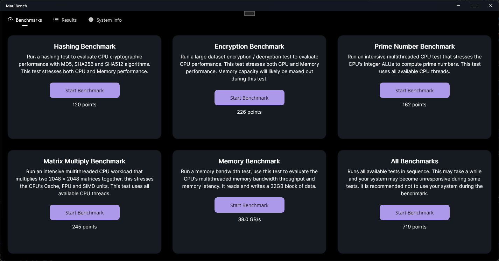
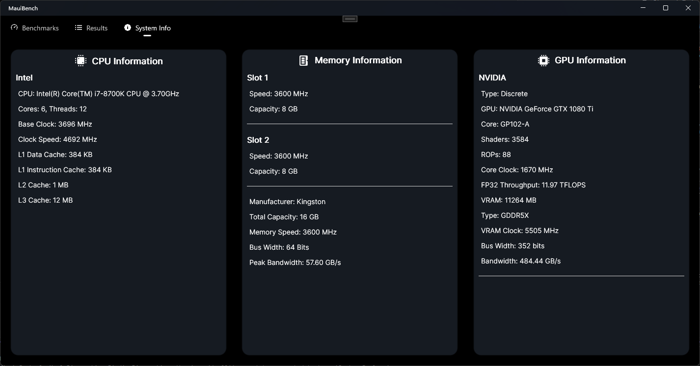
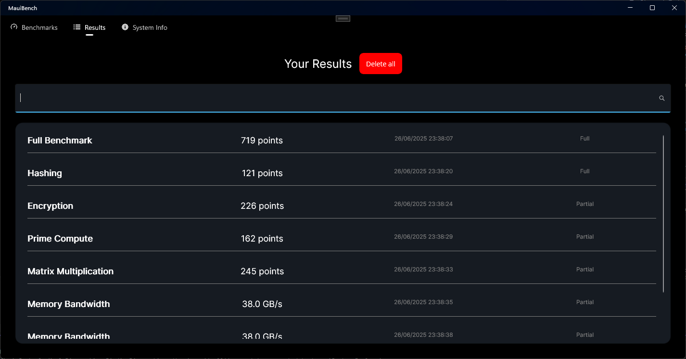

# MauiBench (.NET 9)
### A .Net MAUI application that evaluates CPU performance & provides information about your CPU, GPU, RAM.

## ❌ macOS Support Notice
### Known Performance on macOS (Intel & Apple Silicon)

> ⚠️ **Note:** On macOS Catalyst (Mono runtime), runs noticeably slower than in a standalone .NET Core console app.
> This applies both to Intel Macs (native x64 Mono JIT) and Apple Silicon (ARM64 Mono AOT/JIT),
> because Mono’s codegen and GC are tuned more for quick startup than raw floating‑point throughput.

# Test suite
- 🔢 Integer Performance – Prime number computation.
- 🧮 Floating-Point Performance – Matrix multiplication.
- 🔐 Cryptographic Performance – AES, SHA, MD5 encryption and hashing.
- 💾 Memory Performance – Large dataset encryption operation.
- ⚡ Multithreading & Parallelized workloads.

# Maintenance


# CI/CD & CodeQL

Coming soon...

# Getting Started
- Install `.NET 9 SDK` from <a href="https://dotnet.microsoft.com/download/dotnet/9.0"> here </a>
- Install `.Net 9.0.0 Runtime` from <a href="https://dotnet.microsoft.com/download/dotnet/9.0"> here </a>
- Make sure you have `.Net Maui` installed, check <a href="https://dotnet.microsoft.com/en-us/apps/maui"> here </a>
- Open the solution in your favourite IDE and set "MauiBench" as the startup project.
- Run the project in `Release` mode and without debugging.
- Check your if system specs is correct, then pick a test to run.

> [!NOTE]  
> This project is not signed or notarized.

# Required SDKs & Runtimes

- `.NET 9.0.x` from <a href="https://dotnet.microsoft.com/download/dotnet/9.0"> `here` </a>
- `.Net 9.0.0 Runtime` from <a href="https://dotnet.microsoft.com/download/dotnet/9.0"> `here` </a>
- `.Net Maui` from <a href="https://dotnet.microsoft.com/en-us/apps/maui"> `here` </a>

> [!NOTE]  
> Results should not be compared between different versions of .NET.

# Understanding results
1. Each benchmark returns a result in `ms` (milliseconds).
2. The results are then calculated into a score and displayed on the UI in `points`.
3. The score is calculated from a baseline score unique to each benchmark.
4. The baseline score is based of the time taken on a core i5-8400.

# Tested systems

## MacBookPro 15" 2018

```ini
Intel Core i7-8850H CPU 2.60GHz (Coffee Lake), 6 Cores 12 Threads (6P/0E)
16GB DDR4 2400MHz
Windows 10 bootcamp
```

## Desktop PC

```ini
Intel Core i7-8700K CPU 3.70GHz (Coffee Lake), 6 Cores 12 Threads (6P/0E)
16GB DDR4 3600MHz
Windows 11
```

## Dell latitude 5531

```ini
Intel Core i7-12800H CPU 1.80GHz (Alder Lake), 14 Cores 20 Threads (6P/8E)
32GB DDR5 4800MHz
Windows 11
```

# Benchmark results
## .NET 9 Ranking (Legacy benchmarks):

1. Dell latitude 5531 - i7-12800H @ 55W `TBA`
2. Desktop i7 - i7-8700K @ 4.7ghz `TBA`
3. MacBook Pro 15" 2018 - i7-8850H @ 45W `TBA`

# Minimum system requirements

- .NET 9.0.x
- Dual core CPU
- Windows 10 or MacOS 14
- 8GB RAM
- 1GB Storage

### Supported Platforms
- **Windows 10/11** (x64, .NET 9 or later)  
- **Linux** (x64/ARM64, .NET 9 or later)

### Unsupported Platforms
- **macOS x64 & arm64 (MAUI/Catalyst)**

# Screenshots


